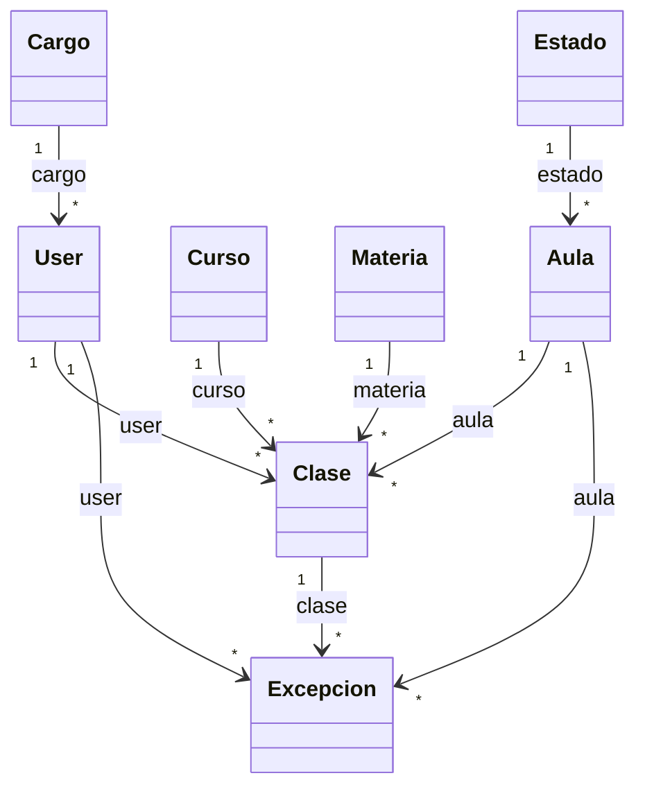

# Diagrama UML del backend

> Generado automáticamente inspeccionando las entidades TypeORM del proyecto.

## Entidades detectadas

- Aula: src/aula/entities/aula.entity.ts
- Cargo: src/cargo/entities/cargo.entity.ts
- Clase: src/clase/entities/clase.entity.ts
- Curso: src/curso/entities/curso.entity.ts
- Estado: src/estado/entities/estado.entity.ts
- Excepcion: src/excepcion/entities/excepcion.entity.ts
- Materia: src/materia/entities/materia.entity.ts
- User: src/auth/entities/user.entity.ts